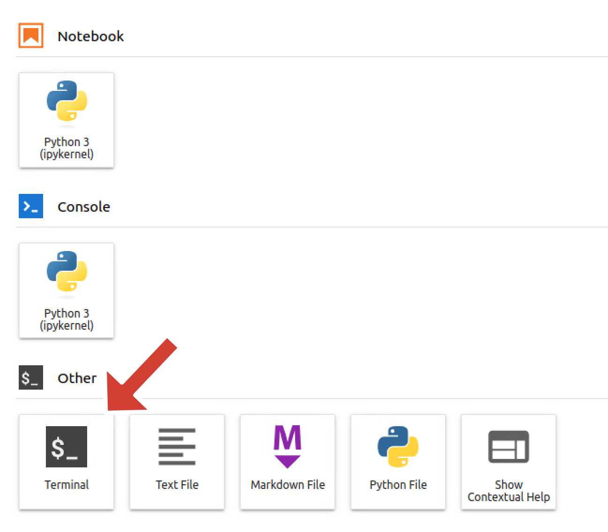

# launch_jupyterlab_gpu

A lightweight Bash workflow to automatically launch a GPU-backed JupyterLab instance on the Arbutus OpenStack cloud and connect to it securely via SSH port forwarding.

## 🧩 Requirements

- A Digital Research Alliance Account
- Member of rrg-akhanf allocation
- python3 and bash

## ⚙️ Setup
```bash
# Step 1. Clone the repository
git clone https://github.com/Dhananjhay/launch_jupyterlab_gpu.git
cd launch_jupyterlab_gpu

# Step 2. Create and activate a virtual environment
python3 -m venv venv
source venv/bin/activate

# Step 3. Install dependencies
pip install python-openstackclient
```

## 🚀 Launching JupyterLab on GPU instance
```bash
# Step 4. Run the launcher
./launch_jupyterlab.sh
```

You’ll be prompted for your OpenStack username and password.
The script will:
- Authenticate with OpenStack
- Create a GPU instance
- Stream the console log until JupyterLab starts
- Display the URL and token for connection
- Wait for you to connect

Press Ctrl + C anytime to stop the instance —
the script will automatically delete the OpenStack server for cleanup.

## 💾 (Optional) Mount Nibi Project Space
To access your Nibi project files, run the following command (switch `<username>` before) on a terminal on JupyterLab:
```bash
sshfs <username>@nibi.sharcnet.ca:/home/<username>/ /home/runner/nibi \
  -o ServerAliveInterval=15,ServerAliveCountMax=3,Compression=no,follow_symlinks

```


## 🧠 Notes

- Average JupyterLab startup time: ~5 minutes
- Default forwarded port: 8181 → 8000
- Logs are stored in /tmp/${SERVER}_console.log during setup